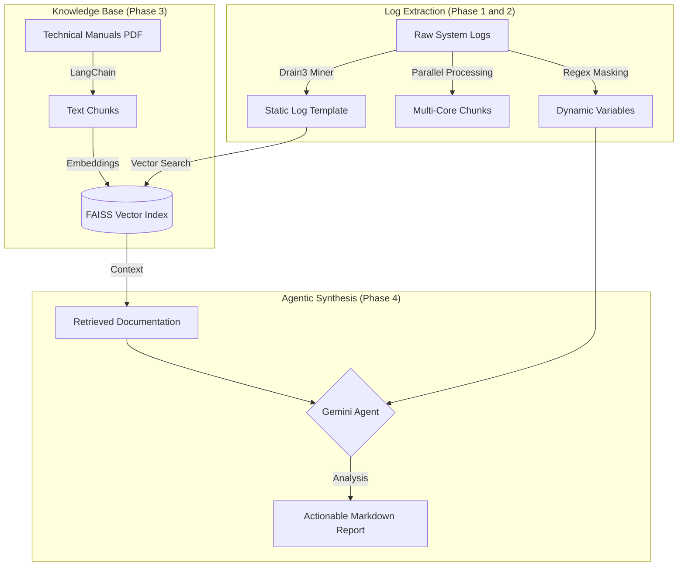

# SiliconSentry: Agentic RAG Log Triage System

[](https://github.com/google/gemini-cli)
[](https://github.com/logpai/drain3)
[](https://github.com/facebookresearch/faiss)

SiliconSentry is an automated, production-ready debugging agent designed for high-throughput environments (Semiconductors, Network Infrastructure, Cloud Ops). This system eliminates manual log scrolling by standardizing raw logs, cross-references errors against official technical documentation, and generates verifiable root-cause reports.

---

## Architecture Overview

Our goal is to create a deterministic pipeline that bridges the gap between unstructured telemetry and structured technical knowledge.



---

## Installation and Execution

### Option 1: Standalone Binary (Fastest)
If you have downloaded the `SiliconSentry` executable, you can run it directly from your terminal. No Python installation is required.

```bash
# Set your API Key
export GOOGLE_API_KEY="your_key_here"

# Run the tool
./SiliconSentry --help
```

### Option 2: Development Setup (Source)
```bash
# Clone and Setup
git clone https://github.com/chinmayrozekar/Log_Parsing_Tool.git
cd Log_Parsing_Tool
python3 -m venv .venv
source .venv/bin/activate
pip install -r requirements.txt
export PYTHONPATH=$PYTHONPATH:.

# Configure API Key
echo "GOOGLE_API_KEY=your_key_here" > .env
```

---

## Usage Examples

### 1. Ingest Technical Manuals
Process a PDF manual into searchable semantic chunks stored in FAISS.
```bash
python3 src/main.py ingest --file docs/manuals/yosys_manual.pdf
```

### 2. Generate Realistic Test Data
```bash
# Generate 60MB Hierarchical PERC DRC Log
python3 src/eda_log_generator.py

# Generate 100MB SLT Benchmark Log
python3 src/slt_log_generator.py
```

### 3. Full Autonomous Analysis
Run the end-to-end pipeline to generate a professional triage report.
```bash
python3 src/main.py analyze --file data/raw_logs/perc_drc_hierarchical.log
```

---

## Building the Binary
To compile the source code into a standalone binary yourself:
```bash
pip install pyinstaller
pyinstaller --noconfirm --onefile --console --add-data "drain3.ini:." --hidden-import charset_normalizer --name SiliconSentry src/main.py
```

---

## Acknowledgments

This project was built and architected in collaboration with Google Gemini CLI. The entire development lifecycle was assisted by Generative AI to ensure production-grade standards and idiomatic Python patterns.

---

**Author:** [Chinmay Rozekar]  
**Objective:** Transforming raw telemetry into actionable engineering intelligence.
