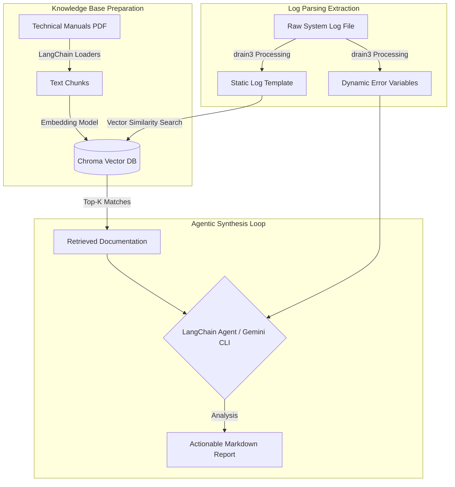

# Log_Parsing_Tool
This is a research project. I am trying to learn efficient methods for log parsing 

```mermaid
graph TD
    subgraph "Knowledge Base Preparation"
        A[Technical Manuals PDF] -->|LangChain Loaders| B[Text Chunks]
        B -->|Embedding Model| C[(Chroma Vector DB)]
    end

    subgraph "Log Parsing Extraction"
        D[Raw System Log File] -->|drain3 Processing| E[Static Log Template]
        D -->|drain3 Processing| F[Dynamic Error Variables]
    end

    subgraph "Agentic Synthesis Loop"
        E -->|Vector Similarity Search| C
        C -->|Top-K Matches| G[Retrieved Documentation]
        G --> H{"LangChain Agent / Gemini CLI"}
        F --> H
        H -->|Analysis| I[Actionable Markdown Report]
    end
```
